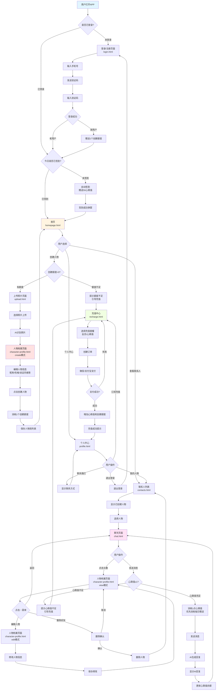

# 云养APP - 用户流程图

## 📖 文档信息
- **文档版本**: v1.0
- **创建日期**: 2025年10月17日
- **文档类型**: 用户流程图

---

## 🎯 全局用户流程图（Mermaid）



---

## 📝 完整用户流程文字描述

### 流程1：新用户注册与首次创建人物

```
1. 用户打开APP
   ↓
2. 检测未登录，进入登录页面（login.html）
   ↓
3. 输入手机号 → 点击"获取验证码"
   ↓
4. 输入6位验证码 → 点击"登录"
   ↓
5. 系统识别为新用户
   - 自动注册
   - 赠送1个人物创建额度
   - 触发每日签到，赠送50心跳值
   ↓
6. 弹窗显示"签到成功，获得50心跳值"
   ↓
7. 进入首页（homepage.html）
   ↓
8. 点击"+"或"上传照片"
   ↓
9. 检查创建额度（✅ 有1个额度）
   ↓
10. 进入上传页面（upload.html）
    ↓
11. 从相册选择照片 → 点击"确认上传"
    ↓
12. AI识别照片（loading提示）
    - 识别时间：2-10秒
    - 生成人物信息：昵称、性格、说话风格等
    ↓
13. 跳转到人物档案页面（character-profile.html，create模式）
    - 显示"🤖 AI智能生成"标识
    - 展示AI生成的所有信息
    ↓
14. 用户查看并编辑人物信息
    - 可修改昵称、出生日期
    - 可调整职业背景、性格特征、说话风格
    - 可更换头像（不重新触发AI识别）
    - 可设置初始关系
    ↓
15. 点击"✨ 创建人物"按钮
    ↓
16. 系统处理：
    - 消耗1个创建额度（剩余0个）
    - 保存人物信息到数据库
    - AI生成开场白
    ↓
17. 返回首页或联系人列表
    - 新创建的人物出现在列表中
```

---

### 流程2：日常聊天与心跳值消耗

```
1. 用户进入APP（已登录）
   ↓
2. 自动检测是否签到
   - 如果今天未签到 → 自动签到，赠送50心跳值
   - 如果已签到 → 直接进入首页
   ↓
3. 首页点击已创建的人物
   或
   联系人列表（contacts.html）点击人物
   ↓
4. 进入聊天页面（chat.html）
   - 右上角显示心跳值余额（例如：❤️ 2400）
   - 显示历史聊天记录
   - 人物显示"正在输入中..."
   - AI发送开场白或主动消息
   ↓
5. 用户在输入框输入消息
   ↓
6. 点击"发送"按钮
   ↓
7. 系统检查心跳值：
   - 总心跳值 = 每日赠送(50) + 永久心跳值(2350) = 2400
   ↓
8. 心跳值充足（✅ ≥1）
   ↓
9. 消耗1点心跳值（优先消耗每日赠送）
   - 每日赠送：50 → 49
   - 总余额：2400 → 2399
   ↓
10. 用户消息显示在右侧（蓝色气泡）
    ↓
11. 显示"正在输入中..."提示（1-3秒）
    ↓
12. AI根据人物设定生成回复
    - 参考人物性格、说话风格、初始关系
    - 保持上下文连贯性
    ↓
13. AI回复显示在左侧（灰色气泡）
    ↓
14. 更新右上角心跳值余额显示
    ↓
15. 用户继续聊天（重复步骤5-14）
```

---

### 流程3：心跳值不足与充值

```
1. 用户在聊天中输入消息
   ↓
2. 点击"发送"按钮
   ↓
3. 系统检查心跳值
   - 每日赠送：0
   - 永久心跳值：0
   - 总余额：0
   ↓
4. ❌ 心跳值不足
   ↓
5. 弹窗提示：
   "心跳值不足，无法发送消息。
   
   是否前往充值？
   
   [取消] [充值]"
   ↓
6. 用户点击"充值"
   ↓
7. 跳转到充值中心（recharge.html）
   - 显示当前余额：0心跳值
   - 显示创建额度：0个
   ↓
8. 两个标签页：会员套餐 | 心动充值
   ↓
9. 用户选择充值方案（例如：月度会员 ¥19.9）
   - 2500心跳值
   - 7个创建额度
   - 30天VIP
   ↓
10. 点击"立即充值"按钮
    ↓
11. 弹窗确认：
    "确认购买月度会员？
    
    价格：¥19.9
    包含：2500心跳值、7个创建额度、30天VIP
    
    [取消] [确认]"
    ↓
12. 用户点击"确认"
    ↓
13. 创建支付订单
    ↓
14. 跳转到支付页面
    - 微信支付 / 支付宝
    - 显示支付二维码或拉起支付APP
    ↓
15. 用户完成支付
    ↓
16. 支付成功，系统处理：
    - 心跳值：0 → 2500
    - 创建额度：0 → 7
    - VIP到期时间：设置为30天后
    ↓
17. 显示充值成功页面
    "✅ 充值成功！
    
    您已获得：
    • 2500心跳值
    • 7个人物创建额度
    • 30天VIP会员"
    ↓
18. 2秒后自动返回个人中心（profile.html）
    - 显示更新后的资产信息
    ↓
19. 用户返回聊天页面
    - 可以继续发送消息
```

---

### 流程4：查看与编辑人物档案

```
1. 用户在聊天页面（chat.html）
   ↓
2. 点击头部人物头像 或 AI消息旁的头像
   ↓
3. 跳转到人物档案页面（character-profile.html，view模式）
   - URL参数：?mode=view&from=chat&id=char_001
   - 右上角显示"⋯"菜单按钮
   - 所有字段只读，不可编辑
   - 底部操作按钮隐藏
   ↓
4. 用户查看人物信息
   - 头像、昵称、出生日期
   - 职业背景、性格特征、说话风格
   - 初始关系
   ↓
5. 用户点击右上角"⋯"菜单
   ↓
6. 弹出菜单选项：
   "请选择操作：
   
   1. ✏️ 编辑人物
   2. 🗑️ 删除好友
   
   输入数字选择："
   ↓
7a. 选择"1. 编辑人物"
    ↓
    跳转到编辑模式（character-profile.html，edit模式）
    - URL参数：?mode=edit&from=chat&id=char_001
    - 所有字段变为可编辑
    - 可更换头像（不触发AI重新识别）
    - 可修改标签
    - 底部显示"💾 保存修改"按钮
    ↓
    用户编辑信息
    ↓
    点击"保存修改"
    ↓
    弹窗："✅ 修改已保存"
    ↓
    返回查看模式（view模式）
    - 显示更新后的信息
    ↓
    点击"← 返回"
    ↓
    返回聊天页面（chat.html）

7b. 选择"2. 删除好友"
    ↓
    二次确认弹窗：
    "确定要删除这个好友吗？
    
    删除后将无法恢复，所有聊天记录也将被清空。
    
    [取消] [确认]"
    ↓
    用户点击"确认"
    ↓
    系统处理：
    - 从人物列表中删除
    - 删除所有聊天记录
    - 已创建人物数量 -1
    - ⚠️ 不退还创建额度
    ↓
    弹窗："好友已删除"
    ↓
    跳转到联系人列表（contacts.html）
    - 该人物已从列表中移除
```

---

### 流程5：创建额度不足

```
1. 用户在首页点击"+"或"创建人物"
   ↓
2. 系统检查创建额度：0个
   ↓
3. ❌ 创建额度不足
   ↓
4. 弹窗提示：
   "创建额度不足
   
   您当前剩余 0 个人物创建额度
   
   获取创建额度：
   • 周度会员（¥9.9）- 赠送3个创建额度
   • 月度会员（¥19.9）- 赠送7个创建额度
   • ¥3充值 - 赠送1个创建额度
   • ¥6充值 - 赠送3个创建额度
   • ¥12充值 - 赠送7个创建额度
   
   是否前往充值？
   
   [取消] [充值]"
   ↓
5. 用户点击"充值"
   ↓
6. 跳转到充值中心（recharge.html）
   - 默认选中"心动充值"标签
   - 高亮显示可获得创建额度的套餐
   ↓
7. 用户完成充值（参考流程3）
   ↓
8. 获得创建额度后返回
   ↓
9. 可以继续创建人物
```

---

### 流程6：每日签到

```
1. 用户每天首次打开APP
   ↓
2. 完成登录验证
   ↓
3. 系统检查最后签到日期：
   - lastSignInDate: "2025-10-16"
   - 今天日期: "2025-10-17"
   - 判断：不是今天 → 可以签到
   ↓
4. 自动执行签到：
   - 赠送50心跳值
   - 存入dailyHeartBalance
   - 更新lastSignInDate为今天
   ↓
5. 延迟0.5秒后弹窗：
   "🎉 每日签到成功！
   
   恭喜您获得50点心跳值
   有效期至今日24:00
   
   快去和小伙伴聊天吧～
   
   [知道了]"
   ↓
6. 用户点击"知道了"
   ↓
7. 进入首页
   - 个人中心显示更新后的心跳值
   ↓
8. 当天再次登录：
   - 系统检查：lastSignInDate = 今天
   - 判断：已签到 → 不再弹窗
   ↓
9. 第二天0:00（服务端）
   - dailyHeartBalance自动清零
   - 下次登录时可再次签到
```

---

### 流程7：个人中心管理

```
1. 用户点击底部导航"我的"
   ↓
2. 进入个人中心（profile.html）
   ↓
3. 显示用户资产：
   - ❤️ 心跳值：2350（总计=每日50+永久2300）
   - 👤 已创建人物：5个
   - 💎 VIP状态：月度会员（剩余25天）
   ↓
4. 功能菜单：
   - 💳 订阅充值
   - 👥 我的人物
   - 📧 联系我们
   - 🚪 退出登录
   ↓
5a. 点击"订阅充值"
    → 跳转到充值中心（recharge.html）
    
5b. 点击"我的人物"
    → 跳转到联系人列表（contacts.html）
    
5c. 点击"联系我们"
    → 弹窗显示：
    "联系我们
    
    客服邮箱：17621792630@163.com
    官方客服微信：17621792630
    官方小红书账号：Dokidoki官方号
    工作时间：9:00-18:00
    
    我们会尽快回复您的问题！
    
    [知道了]"
    
5d. 点击"退出登录"
    → 二次确认："确定要退出登录吗？"
    → 清除token
    → 返回登录页面（login.html）
```

---

## 🔄 关键页面跳转关系总结

| 从页面 | 触发操作 | 跳转到页面 | URL参数 |
|--------|----------|-----------|---------|
| login.html | 登录成功 | homepage.html | 无 |
| homepage.html | 点击+ | upload.html | 无 |
| upload.html | 上传照片 | character-profile.html | mode=create&from=upload |
| character-profile.html(create) | 创建成功 | homepage.html | 无 |
| homepage.html | 点击人物 | chat.html | character=char_id |
| contacts.html | 点击人物 | chat.html | character=char_id |
| chat.html | 点击头像 | character-profile.html | mode=view&from=chat&id=char_id |
| character-profile.html(view) | 点击⋯→编辑 | character-profile.html | mode=edit&from=chat&id=char_id |
| character-profile.html(edit) | 保存修改 | character-profile.html | mode=view&from=chat&id=char_id |
| character-profile.html(view) | 点击返回 | chat.html | character=char_id |
| chat.html | 心跳值不足 | recharge.html | 无 |
| character-profile.html(create) | 额度不足 | recharge.html | 无 |
| recharge.html | 充值成功 | profile.html | 无 |
| profile.html | 点击订阅充值 | recharge.html | 无 |
| profile.html | 点击我的人物 | contacts.html | 无 |
| profile.html | 退出登录 | login.html | 无 |

---

## 💡 异常流程处理

### 异常1：AI识别超时
```
上传照片 → AI识别超时（>10秒）
    ↓
显示提示："识别超时，使用默认人设"
    ↓
使用默认人设跳转到character-profile.html
    ↓
用户可以手动编辑所有信息
```

### 异常2：网络异常
```
用户发送消息 → 网络请求失败
    ↓
显示提示："网络异常，请检查网络连接"
    ↓
消息发送失败，不消耗心跳值
    ↓
提供"重试"按钮
```

### 异常3：支付失败
```
创建订单 → 跳转支付 → 支付失败
    ↓
返回充值页面
    ↓
显示提示："支付失败，请重试"
    ↓
订单状态更新为"已取消"
    ↓
用户可重新选择套餐
```

### 异常4：Token过期
```
用户操作 → 请求接口 → Token验证失败
    ↓
清除本地Token
    ↓
弹窗提示："登录已过期，请重新登录"
    ↓
跳转到登录页面（login.html）
```

---

## 📌 重要业务规则提醒

### 1. 心跳值消耗优先级
```
发送消息消耗1点
    ↓
优先扣除：dailyHeartBalance（每日赠送）
    ↓ 不足
再扣除：heartBalance（永久心跳值）
    ↓ 都不足
拒绝发送 + 引导充值
```

### 2. 每日签到机制
```
- 每日首次登录自动触发
- 赠送50心跳值（存入dailyHeartBalance）
- 有效期至当天24:00
- 次日0:00自动清零
- 同一天只能签到一次
```

### 3. 创建人物消耗
```
- 每创建1个人物消耗1个创建额度
- 新用户赠送1个免费额度
- 额度不足时阻止创建并引导充值
- 删除人物不退还额度
```

### 4. VIP会员权益
```
- 购买会员套餐获得VIP状态
- VIP期间无特殊权益（v1.0预留）
- VIP到期后自动变为普通用户
- 心跳值和创建额度永久有效
```

---

**文档维护**: 云养产品团队  
**最后更新**: 2025年10月17日  
**版本**: v1.0

