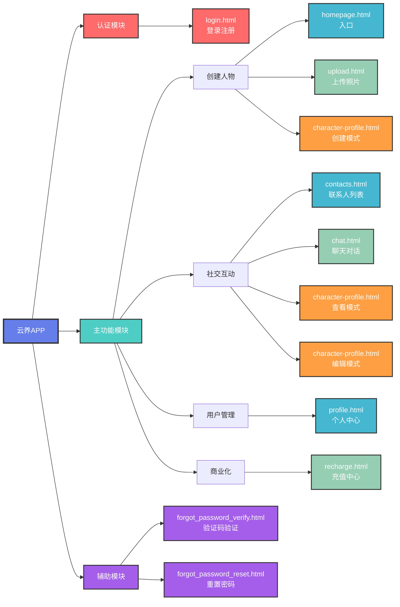

# 云养APP - 页面层级图

## 📖 文档信息
- **文档版本**: v1.0
- **创建日期**: 2025年10月17日
- **文档类型**: 页面架构层级图

---

## 📊 第一种：Mermaid可视化层级图

### 完整页面层级结构


---

### 按功能模块分类的层级图



---

## 📝 第二种：文字树状图

### 按导航层级划分

```
云养APP
│
├─ Level 0: 认证层（Authentication）
│  └─ login.html - 登录/注册页面
│     ├─ 手机号登录
│     ├─ 验证码验证
│     └─ 自动注册新用户
│
├─ Level 1: 主导航层（Main Navigation - 底部Tab）
│  │
│  ├─ homepage.html - 首页 ⭐主入口
│  │  ├─ 展示已创建人物
│  │  ├─ 创建新人物入口（+按钮）
│  │  └─ 每日签到弹窗
│  │
│  ├─ contacts.html - 联系人列表
│  │  ├─ 按字母分组显示
│  │  ├─ 动态加载已创建人物
│  │  └─ 点击进入聊天
│  │
│  └─ profile.html - 个人中心
│     ├─ 用户资产展示
│     │  ├─ 心跳值余额
│     │  ├─ 已创建人物数
│     │  └─ VIP状态
│     ├─ 订阅充值入口
│     ├─ 我的人物
│     ├─ 联系我们
│     └─ 退出登录
│
├─ Level 2: 功能页面层（Feature Pages）
│  │
│  ├─ 创建人物流程
│  │  │
│  │  ├─ upload.html - 上传照片页面
│  │  │  ├─ 从相册选择
│  │  │  ├─ 拍照上传
│  │  │  └─ 照片预览
│  │  │
│  │  └─ character-profile.html（创建模式）
│  │     ├─ mode=create
│  │     ├─ from=upload
│  │     ├─ 展示AI生成的人设
│  │     ├─ 可编辑所有字段
│  │     ├─ 可更换头像（不重新识别）
│  │     └─ 底部"创建人物"按钮
│  │
│  ├─ 社交互动流程
│  │  │
│  │  ├─ chat.html - 聊天页面
│  │  │  ├─ 历史消息展示
│  │  │  ├─ 消息输入（仅文字）
│  │  │  ├─ 右上角心跳值显示
│  │  │  ├─ 头像点击查看档案
│  │  │  └─ 每条消息消耗1心跳值
│  │  │
│  │  ├─ character-profile.html（查看模式）
│  │  │  ├─ mode=view
│  │  │  ├─ from=chat
│  │  │  ├─ 所有字段只读
│  │  │  ├─ 右上角⋯菜单
│  │  │  │  ├─ 编辑人物
│  │  │  │  └─ 删除好友
│  │  │  └─ 底部按钮隐藏
│  │  │
│  │  └─ character-profile.html（编辑模式）
│  │     ├─ mode=edit
│  │     ├─ from=chat
│  │     ├─ 所有字段可编辑
│  │     ├─ 可更换头像（不重新识别）
│  │     └─ 底部"保存修改"按钮
│  │
│  └─ 充值中心
│     │
│     └─ recharge.html - 充值中心
│        ├─ 当前资产展示
│        ├─ 会员套餐
│        │  ├─ 周度会员 ¥9.9
│        │  └─ 月度会员 ¥19.9
│        ├─ 心动充值
│        │  ├─ ¥3 - 200心跳值
│        │  ├─ ¥6 - 500心跳值
│        │  └─ ¥12 - 1200心跳值
│        └─ 立即充值按钮
│
└─ Level 3: 辅助页面层（Auxiliary Pages）
   │
   ├─ forgot_password_verify.html - 找回密码（验证）
   │  ├─ 输入手机号
   │  ├─ 发送验证码
   │  └─ 验证码验证
   │
   └─ forgot_password_reset.html - 找回密码（重置）
      └─ 重置密码成功
```

---

### 按功能模块划分

```
云养APP 功能模块结构
│
├─ 📱 认证模块（Authentication Module）
│  └─ login.html
│     ├─ 功能：手机号+验证码登录
│     ├─ 新用户自动注册
│     └─ 赠送初始资产（1个创建额度）
│
├─ 👤 人物管理模块（Character Management Module）
│  │
│  ├─ 创建子模块
│  │  ├─ homepage.html（创建入口）
│  │  ├─ upload.html（照片上传）
│  │  └─ character-profile.html（mode=create）
│  │
│  ├─ 查看子模块
│  │  ├─ contacts.html（人物列表）
│  │  └─ character-profile.html（mode=view）
│  │
│  └─ 编辑子模块
│     └─ character-profile.html（mode=edit）
│
├─ 💬 社交互动模块（Social Interaction Module）
│  └─ chat.html
│     ├─ 功能：AI对话聊天
│     ├─ 心跳值消耗机制
│     └─ 头像点击查看档案
│
├─ 💰 充值模块（Recharge Module）
│  ├─ 每日签到（homepage.html / profile.html自动触发）
│  └─ recharge.html（充值中心）
│     ├─ 会员订阅
│     └─ 心跳值充值
│
├─ 👥 联系人模块（Contacts Module）
│  └─ contacts.html
│     ├─ 功能：联系人列表管理
│     ├─ 按字母分组
│     └─ 点击进入聊天
│
├─ 👨‍💼 用户中心模块（User Center Module）
│  └─ profile.html
│     ├─ 资产展示
│     ├─ 订阅充值
│     ├─ 我的人物
│     ├─ 联系我们
│     └─ 退出登录
│
└─ 🔧 辅助功能模块（Auxiliary Module）
   ├─ forgot_password_verify.html（找回密码-验证）
   └─ forgot_password_reset.html（找回密码-重置）
```

---

## 📋 第三种：表格分类版

### 表1：按页面层级分类

| 层级 | 页面名称 | 文件名 | 主要功能 | 导航方式 | 访问权限 |
|------|---------|--------|---------|---------|---------|
| **Level 0<br/>认证层** | 登录/注册 | login.html | 手机号登录、验证码验证、自动注册 | 直接访问 | 公开 |
| | 找回密码-验证 | forgot_password_verify.html | 验证码验证 | 从登录页 | 公开 |
| | 找回密码-重置 | forgot_password_reset.html | 重置密码 | 从验证页 | 公开 |
| **Level 1<br/>主导航层** | 首页 | homepage.html | 人物展示、创建入口、签到 | 底部Tab | 需登录 |
| | 联系人 | contacts.html | 联系人列表、快速进入聊天 | 底部Tab | 需登录 |
| | 个人中心 | profile.html | 资产管理、充值入口 | 底部Tab | 需登录 |
| **Level 2<br/>功能层** | 上传照片 | upload.html | 照片选择、AI识别 | 从首页+ | 需登录+额度 |
| | 人物档案-创建 | character-profile.html | 编辑人设、创建人物 | 从上传页 | 需登录+额度 |
| | 聊天 | chat.html | AI对话、心跳值消耗 | 从联系人/首页 | 需登录 |
| | 人物档案-查看 | character-profile.html | 只读查看人物信息 | 从聊天头像 | 需登录 |
| | 人物档案-编辑 | character-profile.html | 编辑已创建人物 | 从查看模式 | 需登录 |
| | 充值中心 | recharge.html | 会员/心跳值充值 | 从个人中心/心跳不足 | 需登录 |

---

### 表2：按功能模块分类

| 功能模块 | 包含页面 | 核心功能 | 主要数据 | 关键业务规则 |
|---------|---------|---------|---------|-------------|
| **认证模块** | login.html<br/>forgot_password_verify.html<br/>forgot_password_reset.html | • 手机号登录<br/>• 验证码验证<br/>• 找回密码 | • 手机号<br/>• 验证码<br/>• Token | • 60秒重发限制<br/>• 验证码5分钟有效<br/>• 新用户自动注册 |
| **人物管理** | homepage.html<br/>upload.html<br/>character-profile.html<br/>contacts.html | • 创建人物<br/>• 查看档案<br/>• 编辑人物<br/>• 删除人物 | • characterList<br/>• createQuota<br/>• characterCount | • 创建消耗1个额度<br/>• 额度不足阻止创建<br/>• 删除不退还额度<br/>• AI识别仅在上传时 |
| **社交互动** | chat.html<br/>character-profile.html | • AI对话<br/>• 聊天记录<br/>• 查看人物档案 | • messages<br/>• heartBalance<br/>• dailyHeartBalance | • 每条消息消耗1心跳<br/>• 优先消耗每日赠送<br/>• 心跳不足引导充值 |
| **充值模块** | recharge.html<br/>profile.html<br/>homepage.html | • 会员订阅<br/>• 心跳值充值<br/>• 每日签到 | • heartBalance<br/>• createQuota<br/>• vipExpireTime<br/>• lastSignInDate | • 每日签到赠送50<br/>• 24:00清零每日赠送<br/>• VIP无特殊权益(v1.0) |
| **用户中心** | profile.html | • 资产展示<br/>• 充值入口<br/>• 我的人物<br/>• 退出登录 | • userInfo<br/>• heartBalance<br/>• characterCount | • 实时显示资产<br/>• 一键跳转功能页 |

---

### 表3：同一页面多模式对比（character-profile.html）

| 对比维度 | create模式 | view模式 | edit模式 |
|---------|-----------|---------|---------|
| **触发入口** | upload.html上传照片后 | chat.html点击头像 | view模式点击⋯→编辑 |
| **URL参数** | ?mode=create&from=upload | ?mode=view&from=chat&id=xxx | ?mode=edit&from=chat&id=xxx |
| **字段编辑** | ✅ 全部可编辑 | ❌ 全部只读 | ✅ 全部可编辑 |
| **头像编辑** | ✅ 可更换 | ❌ 禁用 | ✅ 可更换 |
| **标签选择** | ✅ 可选择 | ❌ 禁用半透明 | ✅ 可选择 |
| **编辑图标** | ✅ 显示 | ❌ 隐藏 | ✅ 显示 |
| **⋯菜单** | ❌ 隐藏 | ✅ 显示 | ❌ 隐藏 |
| **底部按钮** | ✨ 创建人物 | 隐藏 | 💾 保存修改 |
| **AI标识** | ✅ 显示 | ❌ 隐藏 | ❌ 隐藏 |
| **返回逻辑** | 返回upload.html | 返回chat.html | 保存后返回view模式 |
| **业务逻辑** | 消耗1个创建额度 | 仅查看，无消耗 | 仅更新数据，无消耗 |

---

### 表4：页面跳转关系速查表

| 从页面 | 触发操作 | 跳转到 | URL参数 | 是否需要验证 |
|--------|---------|--------|---------|-------------|
| login.html | 登录成功 | homepage.html | 无 | - |
| homepage.html | 点击+ | upload.html | 无 | ✅ 检查创建额度 |
| upload.html | 上传照片 | character-profile.html | mode=create&from=upload | ✅ AI识别 |
| character-profile(create) | 创建成功 | homepage.html | 无 | ✅ 消耗额度 |
| homepage.html | 点击人物 | chat.html | character=char_id | - |
| contacts.html | 点击人物 | chat.html | character=char_id | - |
| chat.html | 点击头像 | character-profile.html | mode=view&from=chat&id=xxx | - |
| character-profile(view) | 点击⋯→编辑 | character-profile.html | mode=edit&from=chat&id=xxx | - |
| character-profile(edit) | 保存修改 | character-profile.html | mode=view&from=chat&id=xxx | - |
| character-profile(view) | 点击返回 | chat.html | character=char_id | - |
| chat.html | 心跳值不足 | recharge.html | 无 | ✅ 心跳值<1 |
| character-profile(create) | 额度不足 | recharge.html | 无 | ✅ 创建额度<1 |
| recharge.html | 充值成功 | profile.html | 无 | - |
| profile.html | 订阅充值 | recharge.html | 无 | - |
| profile.html | 我的人物 | contacts.html | 无 | - |
| profile.html | 退出登录 | login.html | 无 | ✅ 清除token |

---

## 🎯 页面访问权限矩阵

| 页面 | 未登录 | 已登录 | 需要额度 | 需要心跳值 |
|------|-------|-------|---------|-----------|
| login.html | ✅ | ✅ | - | - |
| forgot_password_*.html | ✅ | ✅ | - | - |
| homepage.html | ❌ | ✅ | - | - |
| contacts.html | ❌ | ✅ | - | - |
| profile.html | ❌ | ✅ | - | - |
| upload.html | ❌ | ✅ | - | - |
| character-profile(create) | ❌ | ✅ | ✅ | - |
| character-profile(view) | ❌ | ✅ | - | - |
| character-profile(edit) | ❌ | ✅ | - | - |
| chat.html | ❌ | ✅ | - | - |
| 发送消息功能 | ❌ | ✅ | - | ✅ |
| recharge.html | ❌ | ✅ | - | - |

---

## 📌 关键设计说明

### 1. 底部Tab导航（Level 1）
```
固定显示，全局可访问：
┌─────────┬─────────┬─────────┐
│  🏠首页  │ 👥联系人 │  👤我的  │
└─────────┴─────────┴─────────┘
```

### 2. 特殊页面：character-profile.html
- **一个页面，三种模式**
- 通过URL参数`mode`区分
- 不同模式展示不同功能
- 代码复用，减少维护成本

### 3. 页面深度（点击次数）
```
深度0：login.html（入口）
深度1：homepage/contacts/profile（底部Tab）
深度2：upload/chat/recharge（核心功能）
深度3：character-profile（详情页）

用户路径越短越好，核心功能≤2次点击
```

### 4. 返回逻辑
- 使用URL参数`from`记录来源
- 智能返回到上一个有意义的页面
- 避免返回到中间临时页面

---

## 💡 给技术团队的建议

### 前端路由设计
```javascript
// 建议使用路由守卫
router.beforeEach((to, from, next) => {
  // 1. 检查登录状态
  if (needAuth && !token) {
    return next('/login')
  }
  
  // 2. 检查创建额度（进入创建流程时）
  if (to.path === '/create' && createQuota < 1) {
    alert('创建额度不足')
    return next('/recharge')
  }
  
  // 3. 检查心跳值（发送消息时）
  // 在具体操作中处理
  
  next()
})
```

### 页面状态管理
```javascript
// 建议使用Vuex/Redux等状态管理
store = {
  user: {
    token,
    heartBalance,
    dailyHeartBalance,
    createQuota,
    characterCount
  },
  characters: [...],
  currentChat: {...}
}
```

### 页面缓存策略
```
需要缓存：
- homepage.html（人物列表）
- contacts.html（联系人列表）
- chat.html（聊天记录）

不需要缓存：
- login.html（每次重新登录）
- character-profile.html（实时数据）
- recharge.html（实时金额）
```

---

**文档维护**: 云养产品团队  
**最后更新**: 2025年10月17日  
**版本**: v1.0

