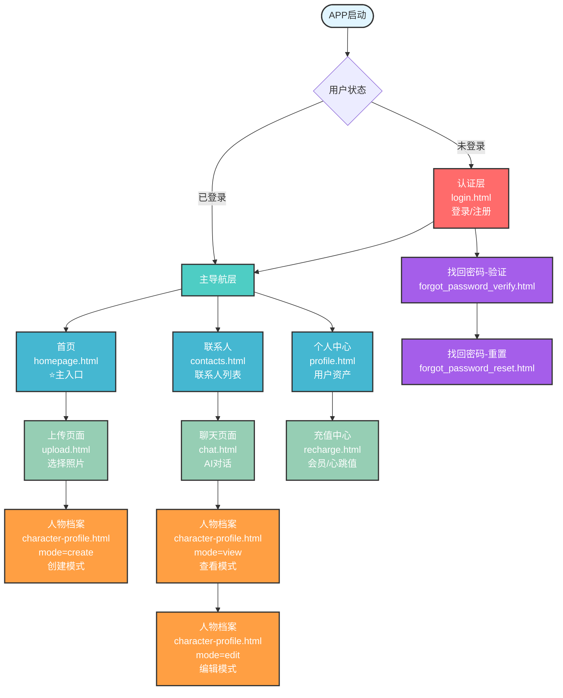

# 云养APP - MVP页面层级图

## 📖 文档信息
- **文档版本**: v1.0
- **创建日期**: 2025年10月17日
- **文档类型**: 页面架构层级图

---

## 📊 MVP页面层级结构

---

## 📋 表格补充说明

### 表1：MVP页面层级分类

| 层级 | 页面名称 | 文件名 | 主要功能 | 导航方式 | 访问权限 |
|------|---------|--------|---------|---------|---------|
| **Level 0 认证层** | 登录/注册 | login.html | 手机号登录、验证码验证、自动注册 | 直接访问 | 公开 |
| | 找回密码-验证 | forgot_password_verify.html | 验证码验证 | 从登录页 | 公开 |
| | 找回密码-重置 | forgot_password_reset.html | 重置密码 | 从验证页 | 公开 |
| **Level 1 主导航层** | 首页 | homepage.html | 人物展示、创建入口、签到 | 底部Tab | 需登录 |
| | 联系人 | contacts.html | 联系人列表、快速进入聊天 | 底部Tab | 需登录 |
| | 个人中心 | profile.html | 资产管理、充值入口 | 底部Tab | 需登录 |
| **Level 2 功能层** | 上传照片 | upload.html | 照片选择、AI识别 | 从首页+ | 需登录+额度 |
| | 人物档案-创建 | character-profile.html | 编辑人设、创建人物 | 从上传页 | 需登录+额度 |
| | 聊天 | chat.html | AI对话、心跳值消耗 | 从联系人/首页 | 需登录 |
| | 人物档案-查看 | character-profile.html | 只读查看人物信息 | 从聊天头像 | 需登录 |
| | 人物档案-编辑 | character-profile.html | 编辑已创建人物 | 从查看模式 | 需登录 |
| | 充值中心 | recharge.html | 会员/心跳值充值 | 从个人中心/心跳不足 | 需登录 |

---

### 表2：character-profile.html页面多模式对比

| 对比维度 | create模式 | view模式 | edit模式 |
|---------|-----------|---------|---------|
| **触发入口** | upload.html上传照片后 | chat.html点击头像 | view模式点击⋯→编辑 |
| **URL参数** | ?mode=create&from=upload | ?mode=view&from=chat&id=xxx | ?mode=edit&from=chat&id=xxx |
| **字段编辑** | ✅ 全部可编辑 | ❌ 全部只读 | ✅ 全部可编辑 |
| **头像编辑** | ✅ 可更换 | ❌ 禁用 | ✅ 可更换 |
| **标签选择** | ✅ 可选择 | ❌ 禁用半透明 | ✅ 可选择 |
| **编辑图标** | ✅ 显示 | ❌ 隐藏 | ✅ 显示 |
| **⋯菜单** | ❌ 隐藏 | ✅ 显示 | ❌ 隐藏 |
| **底部按钮** | ✨ 创建人物 | 隐藏 | 💾 保存修改 |
| **AI标识** | ✅ 显示 | ❌ 隐藏 | ❌ 隐藏 |
| **返回逻辑** | 返回upload.html | 返回chat.html | 保存后返回view模式 |
| **业务逻辑** | 消耗1个创建额度 | 仅查看，无消耗 | 仅更新数据，无消耗 |

---

### 表3：页面跳转关系速查表

| 从页面 | 触发操作 | 跳转到 | URL参数 | 是否需要验证 |
|--------|---------|--------|---------|-------------|
| login.html | 登录成功 | homepage.html | 无 | - |
| homepage.html | 点击+ | upload.html | 无 | ✅ 检查创建额度 |
| upload.html | 上传照片 | character-profile.html | mode=create&from=upload | ✅ AI识别 |
| character-profile(create) | 创建成功 | homepage.html | 无 | ✅ 消耗额度 |
| homepage.html | 点击人物 | chat.html | character=char_id | - |
| contacts.html | 点击人物 | chat.html | character=char_id | - |
| chat.html | 点击头像 | character-profile.html | mode=view&from=chat&id=xxx | - |
| character-profile(view) | 点击⋯→编辑 | character-profile.html | mode=edit&from=chat&id=xxx | - |
| character-profile(edit) | 保存修改 | character-profile.html | mode=view&from=chat&id=xxx | - |
| character-profile(view) | 点击返回 | chat.html | character=char_id | - |
| chat.html | 心跳值不足 | recharge.html | 无 | ✅ 心跳值<1 |
| character-profile(create) | 额度不足 | recharge.html | 无 | ✅ 创建额度<1 |
| recharge.html | 充值成功 | profile.html | 无 | - |
| profile.html | 订阅充值 | recharge.html | 无 | - |
| profile.html | 我的人物 | contacts.html | 无 | - |
| profile.html | 退出登录 | login.html | 无 | ✅ 清除token |

---

## 🎯 页面访问权限速查表

| 页面 | 未登录 | 已登录 | 需要额度 | 需要心跳值 |
|------|-------|-------|---------|-----------|
| login.html | ✅ | ✅ | - | - |
| forgot_password_*.html | ✅ | ✅ | - | - |
| homepage.html | ❌ | ✅ | - | - |
| contacts.html | ❌ | ✅ | - | - |
| profile.html | ❌ | ✅ | - | - |
| upload.html | ❌ | ✅ | - | - |
| character-profile(create) | ❌ | ✅ | ✅ | - |
| character-profile(view) | ❌ | ✅ | - | - |
| character-profile(edit) | ❌ | ✅ | - | - |
| chat.html | ❌ | ✅ | - | - |
| 发送消息功能 | ❌ | ✅ | - | ✅ |
| recharge.html | ❌ | ✅ | - | - |

---

**文档维护**: 云养产品团队  
**最后更新**: 2025年10月17日  
**版本**: v1.0
